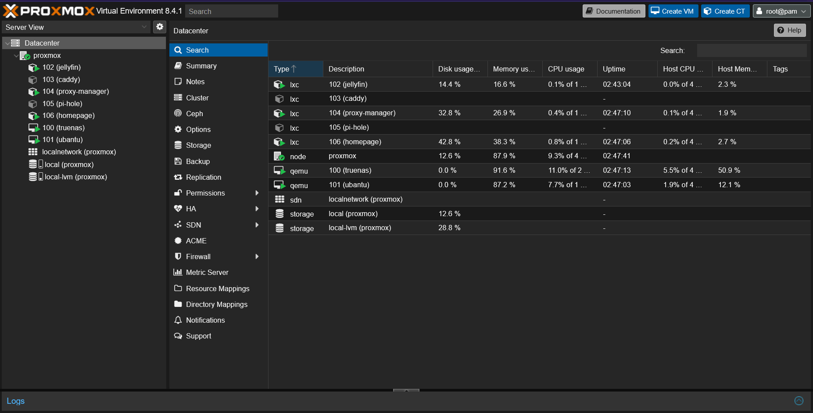

# Proxmox VE – Hypervisor Configuration

This directory documents the setup of the primary hypervisor used in the homelab: **Proxmox Virtual Environment**. It includes system specifications, container/VM management, and supporting files.

---

## Overview

Proxmox VE is an open-source, Type-1 (bare-metal) hypervisor designed for managing virtual machines (KVM) and containers (LXC) through a powerful web interface and command-line utilities. It provides clustering, high-availability, storage management, backups, and firewall integrations in a single package.

While several hypervisors exist—such as **XCP-ng**, **VMware ESXi**, or **VirtualBox**—Proxmox stands out in homelab scenarios for being free, open-source, and highly extensible.

---

## Why Proxmox?

- Web-based GUI and CLI access
- Support for both full virtualization (KVM) and lightweight containers (LXC)
- Integrated backup/restore and snapshot management
- Native ZFS support
- Active community and frequent updates

---

## Current Node Configuration

- **Hostname:** `proxmox`
- **Device:** HP EliteDesk G3 SFF
- **CPU:** Intel i5-6500 (4 cores / 4 threads)
- **RAM:** 16 GB DDR4
- **Storage:**  
  - `local-lvm`: for VM/LXC root disks  
  - `local`: for ISO, templates, and backups

---

## Containers & VMs

| ID  | Type | Name            | Description           |
|-----|------|------------------|------------------------|
| 102 | LXC  | jellyfin         | Media server          |
| 103 | LXC  | caddy            | Reverse proxy         |
| 104 | LXC  | proxy-manager    | Nginx Proxy Manager   |
| 105 | LXC  | pi-hole          | DNS Ad Blocker        |
| 106 | LXC  | homepage         | Dashboard UI          |
| 100 | VM   | truenas          | NAS storage system    |
| 101 | VM   | ubuntu           | Generic Ubuntu base   |

---

## Web Interface Preview

> Proxmox VE (v8.4.1) – Live view of current node status, containers, and VMs.

---

## Networking

- **Bridge:** `vmbr0` (LAN static IP: `192.168.1.45`)
- **Access URL:** `https://192.168.1.45:8006` (internal)
- **Remote Access:** via Tailscale (private tunnel)

---

## Installation Guide

You can install any hypervisor depending on your hardware and use case. Popular choices include:

- **VirtualBox** – for testing on desktops/laptops
- **VMware ESXi** – widely used in enterprise environments
- **XCP-ng** – powerful open-source Xen-based alternative

In this setup, we chose **Proxmox VE** for its balance of simplicity, features, and performance. 

### What is a Hypervisor?

A **hypervisor** is software that creates and runs virtual machines. It allows a single physical machine to host multiple independent operating systems, providing isolation and better utilization of resources.

There are two major types:
- **Type 1 (bare-metal)**: runs directly on hardware (e.g., Proxmox, ESXi)
- **Type 2 (hosted)**: runs within an existing OS (e.g., VirtualBox)

### Proxmox Installation Video

For a guided walkthrough on installing Proxmox VE:

▶️ [Watch this Proxmox install video](https://youtu.be/zngSuqCM4d8?si=VxF1lRa_8nT1dMJa)

---

## Basic Installation Steps

1. Download the ISO from: [Proxmox Downloads](https://www.proxmox.com/en/downloads)
2. Flash ISO using Rufus or BalenaEtcher
3. Boot into USB on your system
4. Follow installer to configure:
   - Storage (ZFS, ext4, LVM)
   - Hostname & root password
   - IP addressing
5. Reboot and access via `https://your-ip:8006`

---

## Next Step: Install TrueNAS in a VM

After setting up Proxmox, we move on to installing **TrueNAS** inside a dedicated virtual machine to handle storage across the network.
