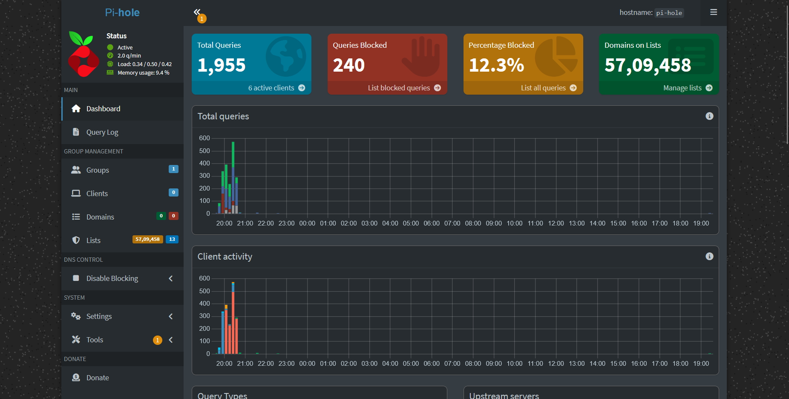

# Networking Setup – Minimal Cost, Maximum Efficiency

Networking for homelab setups can get expensive quickly — routers, switches, VLANs, UPS, and more. But in my case, I’ve kept it as simple and budget-friendly as possible.



## Overview

- **Devices**: Single PC acting as NAS, hypervisor, and DNS filter
- **Network Cost**: ₹0 (no extra router, no switch)
- **Connection Type**: Ethernet (for stability and speed)

---

## 1. ISP Modem Configuration

By default, most modems use the IP range `192.168.1.0 – 192.168.1.254`. I customized this to better isolate homelab devices and assign static IPs easily.

### New IP Range:

- **Modem Range**: `192.168.1.122 – 192.168.1.254`
- **Reserved for Homelab**: `192.168.1.2 – 192.168.1.121`

This gives me full control over IP allocation without interfering with DHCP clients.

### Steps to Change IP Range:

1. Open your browser and go to the modem admin panel  
   (usually `http://192.168.1.1`)
2. Login with admin credentials
3. Go to **LAN/DHCP Settings**
4. Set the DHCP start and end range to:  
   - **Start**: `192.168.1.122`  
   - **End**: `192.168.1.254`
5. Save and reboot the modem

---

## 2. Pi-hole Setup (Ad-blocking DNS)

To block ads and trackers network-wide, I deployed Pi-hole in an LXC container.

### Steps:

1. **Download Ubuntu LTS 22.04 template** inside Proxmox
2. Launch a new LXC container with this template
3. Access the container and run:
   ```bash
   sudo apt update && sudo apt upgrade -y
   sudo apt install docker.io docker-compose -y
4. Create a docker-compose.yml file for Pi-hole 
5. Start Pi-hole:
    ```bash
    docker-compose up -d
    ```
6. Access the Pi-hole dashboard at:
    ```bash
     http://<your-pihole-ip>/admin
    ```
7. On both your PC and phone, manually set the DNS to your Pi-hole IP (192.168.1.X)