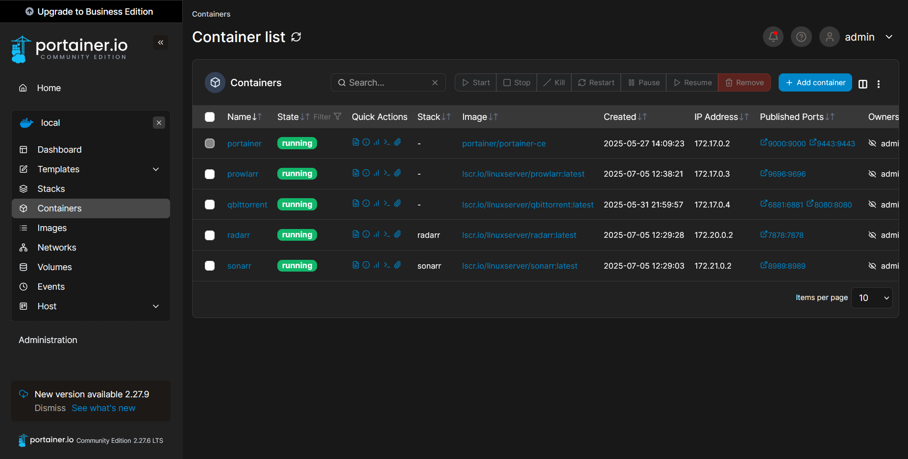

# Self-Hosted Media Server Setup with Docker & VPN

Before starting my homelab journey, I had no idea it was possible to stream media from a local server using apps — I used to manually download everything and watch it with a player like VLC.

But after testing it once, I was fully convinced. The setup not only automates downloads but also gives a proper Netflix-like UI, all hosted privately.

---


## Overview of the Setup

- **Virtual Machine**: 1 vCPU, 2 GB RAM, 32 GB SSD
- **Base OS**: Ubuntu Server 22.04 (you can use any modern Linux distro)
- **Services**: Gluetun (VPN), qBittorrent, NZBGet, Prowlarr, Sonarr, Radarr
- **Management**: Portainer (optional, used as a Docker UI)
- **Media Mount**: Mounted SMB share from NAS for storage
- **Jellyfin**: Skipped in this VM — set up separately in a dedicated LXC container

---

## Step-by-Step Setup

### 1. Create and Configure the VM

1. Upload the Ubuntu Server ISO to Proxmox (or your hypervisor)
2. Create a new VM with static IP assignment
3. Use SSH to connect:
   ```bash
   ssh user@your_vm_ip
   ```


2. Install Docker and Docker Compose

Use Docker's official convenience script:
```bash
    curl -fsSL https://get.docker.com | sudo sh
    sudo apt install docker-compose -y
    ```

3. Optional: Install Portainer (Docker Web UI)

Create a Docker Compose file for Portainer:
File: `portainer-docker-compose.yml`
Run it:
```bash
    docker-compose -f portainer-docker-compose.yml up -d
    ```
Access it at: ` https://your_vm_ip:9443`

4. Mount SMB Share (Media Folder)

Ensure your media library from NAS is available to the VM:
```bash
    sudo apt install cifs-utils
sudo mkdir /data

# Add credentials to a secure file
sudo nano /etc/smb-credentials
# Add:
# username=your_smb_user
# password=your_smb_pass

sudo chmod 600 /etc/smb-credentials

# Mount manually for testing
sudo mount -t cifs //nas_ip/share /data -o credentials=/etc/smb-credentials

# Make it permanent (optional)
sudo nano /etc/fstab
//nas_ip/share /data cifs credentials=/etc/smb-credentials,iocharset=utf8,uid=1000,gid=1000,nounix,noserverino 0 0
```

5. Deploy the Media Stack

Download the following `media-stack-docker-compose.yml` and rename it:
```bash
wget https://yourdomain.tld/media-stack-docker-compose.yml
mv media-stack-docker-compose.yml docker-compose.yml
```
Ensure you have the required `.env` file (with VPN credentials, ports, UID/GID, etc.).
Spin it up:`docker-compose up -d`

6. Services Overview

| Service     | Port  | Purpose             |
|-------------|-------|---------------------|
| Portainer   | 9443  | Docker UI           |
| qBittorrent | 8080  | Torrent Client      |
| NZBGet      | 6789  | Usenet Downloader   |
| Prowlarr    | 9696  | Indexer Manager     |
| Sonarr      | 8989  | TV Shows Automation |
| Radarr      | 7878  | Movies Automation   |

> All torrent/usenet traffic is routed through **Gluetun (VPN)**.


7. Connect the Stack

Once all services are running:

1.    In Prowlarr, add indexers (e.g., RARBG, 1337x, etc.)

2.    In Sonarr/Radarr, connect to Prowlarr and your download clients (qBittorrent/NZBGet)

3.    Set root download path as /data for both movies and TV shows

4.    Access everything via web:

        `http://your_ip:8989` (Sonarr)

        `http://your_ip:7878` (Radarr)

        `etc.`