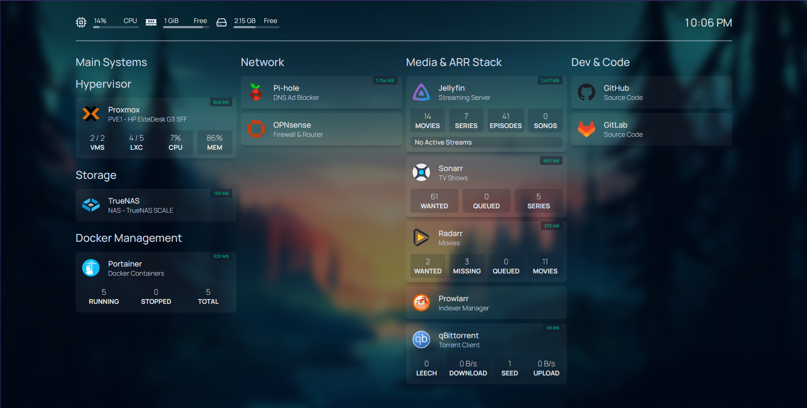

# 🧰 My Personal Homelab Stack – Modular, Local, Google-Free

Welcome to my homelab setup — a fully self-hosted, no-cloud, modular, and privacy-respecting system.  
Every folder in this repo represents a different layer of the stack. From bare-metal virtualization to dashboards and media automation — it's all here.

---

## 📂 Structure Overview

| Folder            | Purpose                                          |
|-------------------|--------------------------------------------------|
| `01_hypervisor`   | Base machine running **Proxmox VE**              |
| `02_A nas`        | Storage setup with **TrueNAS SCALE**             |
| `03_network`      | Networking config, **Pi-hole**, **NGINX + SSL**  |
| `04_media stack`  | Docker-based **Sonarr, Radarr, Prowlarr**, etc.  |
| `05_de Google`    | Google replacements: **Nextcloud**, **Immich**   |
| `06_homepage`     | Homelab dashboard using `gethomepage.dev`        |

---

## 🌐 Philosophy

- 🔒 **Privacy First** – No Google, no telemetry, full local control.
- ⚙️ **Modular** – Each component lives in its own clean folder.
- 💻 **Real Hardware** – Running on reused PCs, not cloud VMs.
- 🐧 **Linux + Open Source** – From the hypervisor to app stack.

---

## 🚀 Tech Stack Highlights

- **Proxmox VE** – Virtualization platform
- **TrueNAS SCALE** – For ZFS-powered NAS
- **Docker + Compose** – Containerized services
- **Pi-hole** – Network-wide ad-blocking
- **Gluetun** – VPN gateway for torrent traffic
- **Homepage** – Central dashboard UI
- **Nextcloud / Immich** – Google-free drive + photos

---

## 📷 Sneak Peek

> 

---

## ✅ Getting Started

Want to replicate this? Clone the repo and explore one folder at a time.

```bash
git clone https://github.com/yourname/homelab-stack.git
cd homelab-stack
```

Start from `01_hypervisor/` and follow the folder-level `readme.md` files.  
All instructions are beginner-friendly and platform-specific.

---

## 📦 Goals

- A fully automated, self-healing media setup
- Powerful yet quiet 24x7 server using recycled hardware
- All services accessible securely over LAN or VPN
- No Google. No Dropbox. No ads.

---

## 📌 Notes

- No college project BS — this is real-world config
- Everything is written from scratch based on actual use
- Feedback, PRs, and forks welcome

---

